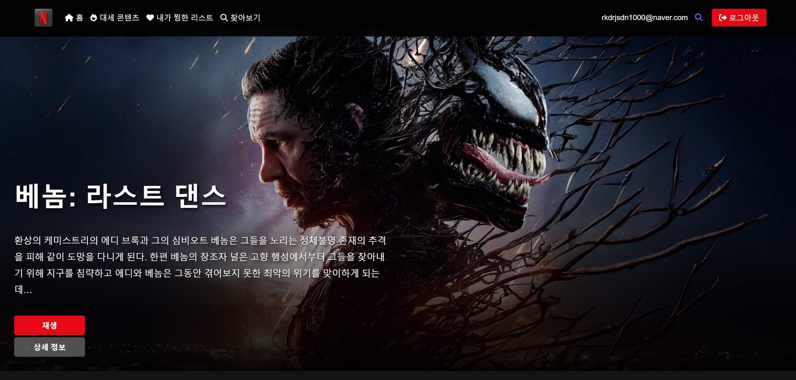

# 🎬 Netflix Clone Project

현대적인 UI/UX를 갖춘 Netflix 스타일의 영화 스트리밍 서비스 클론 프로젝트입니다.

## 📸 스크린샷

## 🌐 배포 링크
**[넷플릭스 클론 웹사이트 바로가기](https://hilarious-lolly-e4a1fe.netlify.app/)**

## 🌟 주요 기능

### 인증 시스템 🔐
- 회원가입 및 로그인 
- Local Storage를 활용한 세션 관리 
- 보안된 라우팅 시스템 
- 카카오 소셜 로그인 연동

### 홈 페이지 🏠
- 동적 배너 표시
- 카테고리별 영화 슬라이더
- 반응형 레이아웃

### 영화 기능 🎥
- TMDB API 기반 영화 정보 표시
- 영화 검색 기능
- 장르별 필터링
- 무한 스크롤
- 찜하기 기능

### UI/UX 특징 ✨
- 반응형 디자인 (모바일, 태블릿, 데스크톱)
- 부드러운 애니메이션과 트랜지션
- 직관적인 네비게이션
- 모바일 최적화

## 🛠 기술 스택

### Frontend
- **React.js** - 프레임워크
- **Redux Toolkit** - 상태 관리
- **React Query** - 서버 상태 관리
- **React Router** - 라우팅
- **Axios** - HTTP 클라이언트

### 스타일링
- **CSS3** - 스타일링
- **CSS Custom Properties** - 테마 관리
- **CSS Animations** - 애니메이션

### API
- **TMDB API** - 영화 데이터

## 📱 반응형 디자인

- Desktop (1200px+)
- Tablet (768px - 1199px)
- Mobile (320px - 767px)
- 다양한 화면 방향 지원 (Portrait/Landscape)

## 💫 주요 구현 사항

1. **컴포넌트 구조**
   - 재사용 가능한 컴포넌트 설계
   - Props를 통한 데이터 전달
   - Event Handling을 통한 상호작용

2. **소셜 로그인 구현**
   - Kakao OAuth 2.0 인증 시스템 통합
   - REST API 기반 카카오 로그인 구현
   - 사용자 프로필 정보 연동
   - 로그인 상태 유지 및 토큰 관리

3. **상태 관리**
   - Redux를 통한 전역 상태 관리
   - React Query를 통한 서버 상태 관리
   - Local Storage를 통한 영구 데이터 저장

4. **성능 최적화**
   - 이미지 최적화
   - 무한 스크롤 구현
   - 조건부 렌더링

## 🚀 설치 및 실행
### 📦 설치
- 프로젝트를 로컬 환경에 설치하고 실행하기 위한 단계는 다음과 같습니다.

#### 의존성 설치
- 프로젝트에 필요한 모든 의존성을 설치합니다.
- npm install
#### 주요 패키지 설치 내역
- 프로젝트에 필요한 주요 패키지들을 명시적으로 설치합니다.
### 개별 명령어로 설치
##### FontAwesome
- npm install @fortawesome/fontawesome-svg-core @fortawesome/free-solid-svg-icons @fortawesome/react-fontawesome
##### Redux Toolkit
- npm install @reduxjs/toolkit
##### React Query
- npm install @tanstack/react-query @tanstack/react-query-devtools
##### Testing Libraries
- npm install @testing-library/jest-dom @testing-library/react @testing-library/user-event
##### 기타 주요 라이브러리
- npm install axios cross-env env-cmd framer-motion react react-dom react-dotenv react-lazy-load-image-component react-redux react-router-dom react-scripts react-toastify web-vitals

##### DevDependencies
- npm install @babel/plugin-proposal-private-property-in-object --save-dev

### 최종 정리

#### 프로젝트 의존성 설치
- npm install @fortawesome/fontawesome-svg-core @fortawesome/free-solid-svg-icons @fortawesome/react-fontawesome @reduxjs/toolkit @tanstack/react-query @tanstack/react-query-devtools @testing-library/jest-dom @testing-library/react @testing-library/user-event axios cross-env env-cmd framer-motion react react-dom react-dotenv react-lazy-load-image-component react-redux react-router-dom react-scripts react-toastify web-vitals

#### 개발 의존성 설치
- npm install @babel/plugin-proposal-private-property-in-object --save-dev

### 개발 서버 실행 (http://localhost:3000)
npm run start:dev

### 온라인 데모
- 배포된 웹사이트: https://web4-kakao.netlify.app
- Netlify를 통한 지속적 배포 구현

